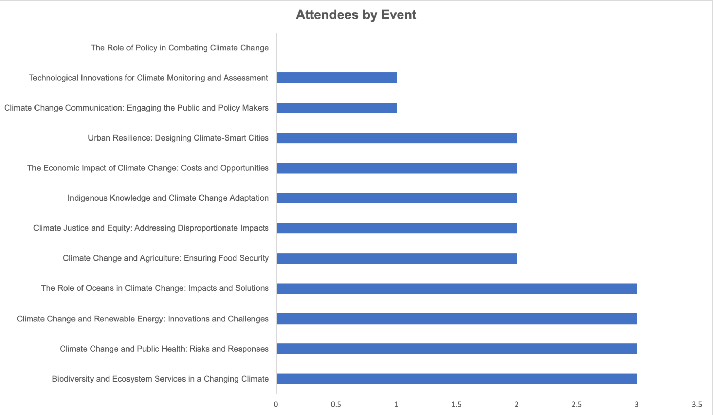
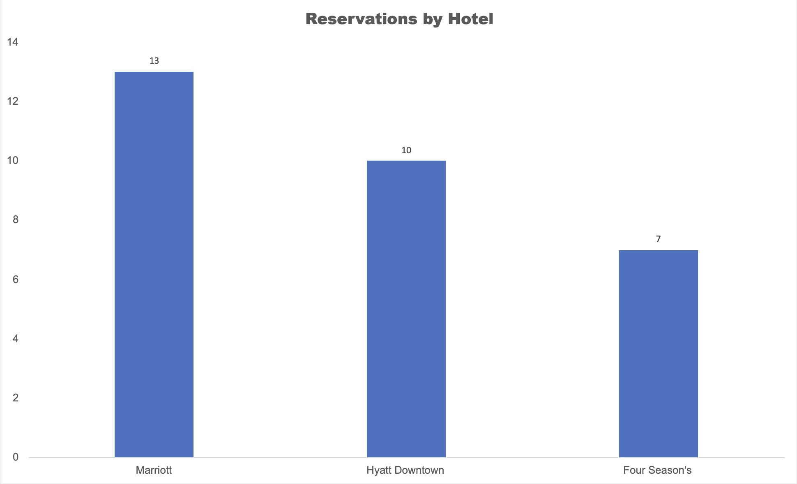
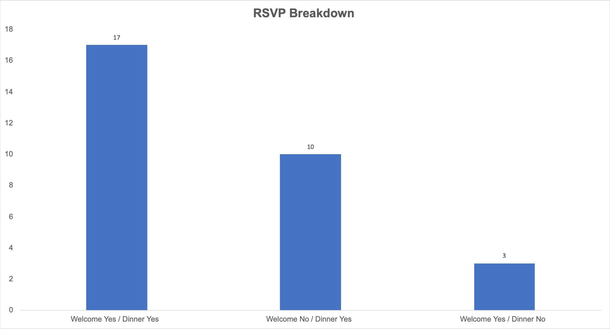

# VIP Conference Analytics | SQL Case Study

## Overview
This SQL case study analyzes VIP conference attendance, hotel reservations, RSVP behavior, and attendee relationships using a course-provided relational dataset. The project applies joins, self-joins, aggregations, and subqueries to answer business questions and support conference planning decisions.

## Tools Used
- SQL
- PostgreSQL
- Excel

## Dataset Snapshot
- 30 VIP members
- 30 reservation records
- 12 conference events
- 3 hotels

## Key Findings
- Events 2, 4, 6, and 7 had the highest attendance, with 3 attendees each
- Marriott had the highest reservation volume
- 17 attendees RSVP’d yes to both the welcome event and dinner
- 6 VIPs were not assigned to an event
- 3 VIPs did not have a matching reservation record
- 3 reservation records did not match a VIP in the attendee table

## Project Visuals

## Skills Demonstrated
SQL, joins, subqueries, aggregation, data validation, relational databases, business analysis
